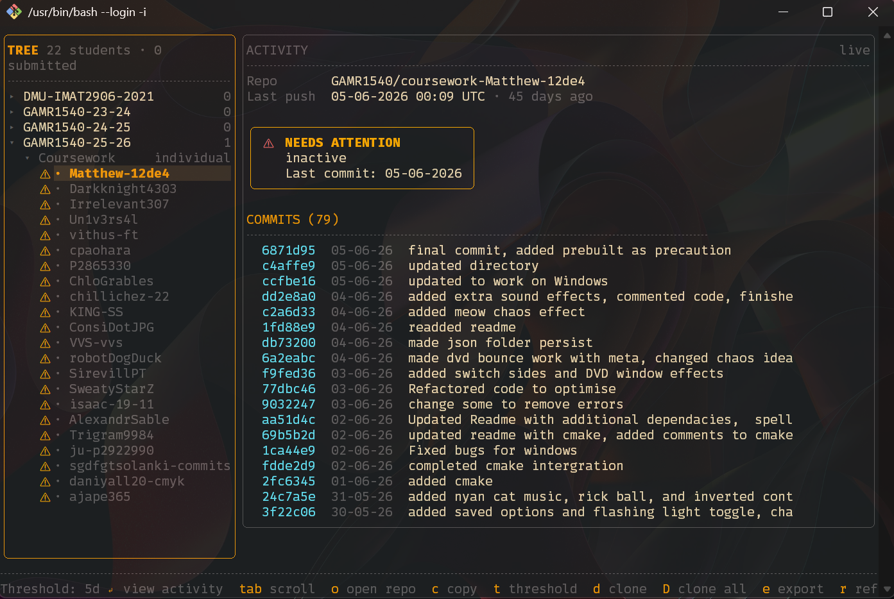

[](https://github.com/juzor/ghclassroom/actions/workflows/ci.yml)

# ghclassroom

Terminal UI for browsing GitHub Classroom — classrooms, assignments, student submissions, repo activity, inactivity detection, repo cloning, and commit history export.



## Requirements

- Go 1.22 or later
- Linux: `libx11-dev` (required for clipboard support; install via your package manager)

## Install

```
go install ghclassroom@latest
```

Or build from source:

```
git clone https://github.com/your-org/ghclassroom
cd ghclassroom
go install .
```

Or build a binary using make:

```
git clone https://github.com/your-org/ghclassroom
cd ghclassroom
make build-bin
```

Or build an executable (Windows) using make:

```
git clone https://github.com/your-org/ghclassroom
cd ghclassroom
make build-exe
```

## First run

On first launch you will be prompted for a GitHub personal access token:

```
GitHub personal access token required.
Required scopes: repo, read:org
Generate one at: https://github.com/settings/tokens

Paste token:
```

The token is stored in `~/.config/ghclassroom/config.json` and reused on subsequent runs. To reset it:

```
ghclassroom --reconfigure
```

Required token scopes:

| Scope | Why |
|-------|-----|
| `repo` | Read student repository contents and commits |
| `read:org` | List classrooms and assignments via the Classroom API |

## CLI flags

| Flag | Default | Description |
|------|---------|-------------|
| `--threshold N` | `5` | Override the inactivity threshold (days) for this session |
| `--reconfigure` | — | Delete the saved token and re-run first-run setup |
| `--version` | — | Print version and exit |

## Key bindings

### Navigation (all panels)

| Key | Action |
|-----|--------|
| `↑` `↓` or `j` `k` | Move selection |
| `→` `↵` or `l` | Expand item / view activity |
| `←` `Esc` `-` or `h` | Collapse / go back |
| `Tab` | Switch focus between sidebar and content panel |
| `o` | Open selected URL in browser |
| `c` | Copy URL to clipboard |
| `r` | Refresh current panel |
| `q` or `Ctrl+C` | Quit |

### Assignment level

| Key | Action |
|-----|--------|
| `/` | Filter student list |
| `e` | Export all student commits to CSV and Excel |

### Student level

| Key | Action |
|-----|--------|
| `t` | Set inactivity threshold (days) inline and re-run classifier |
| `d` | Clone the selected student's repository |
| `D` | Clone all repositories for the assignment |
| `e` | Export all student commits to CSV and Excel |
| `r` | Refresh all activity for the assignment and re-run classifier |

## Inactivity classifier

After students load, ghclassroom fetches all repository activity in the background and runs an inactivity classifier. Each student entry in the sidebar is marked:

| Indicator | Meaning |
|-----------|---------|
| `⚠` (amber) | Needs attention — one or more inactivity signals detected |
| `✓` (green) | Active — no inactivity signals |
| `✓` (cyan) | Submitted — classifier has not run yet |
| `·` | Not yet submitted |

When a student needing attention is selected, the activity panel shows a badge listing the specific signals (e.g. no commits in threshold period, no pull requests, no branches beyond the default).

The threshold defaults to **5 days** and can be changed permanently via `--threshold` or per-session via the `t` key.

## Downloading repositories

Press `d` on a student node to clone that student's repository, or `D` to clone all repositories for the assignment into a chosen directory. If the destination already exists, `git pull` is run instead. Three repos are cloned in parallel; progress is shown in the status bar. The last-used download directory is remembered across sessions.

## Exporting commit history

Press `e` on an assignment or student node to export the full commit history for all students in that assignment. You will be prompted to choose an output directory. Two files are written:

- `{assignment-title}_{date}.csv` — plain CSV with columns: Assignment, Student, Repository, SHA, Date, Message
- `{assignment-title}_{date}.xlsx` — Excel workbook with bold blue header row, frozen header, and sized columns

The last-used export directory is remembered across sessions.

## Limitations

- **No auto-refresh.** Data is cached for the session; press `r` to reload.
- **Read-only.** ghclassroom never writes to GitHub — no assignment creation, no grading, no repository modification.
- **API rate limits.** The GitHub API allows 5 000 requests per hour for authenticated users. Heavy use across many classrooms can approach this limit; a countdown is shown if it is reached.
